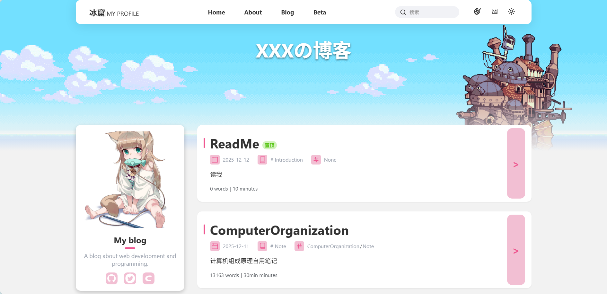

## 冰窟 Blog

一个简洁风格的个人博客！

<div align="center">


<pre>
	🖥️ 计算机在读 • 前端萌新
	⌨️ HTML / CSS / JS / Markdown 入门中
	✨ 喜欢 Anime • 沉迷 Lo-fi • 偏爱雪天 • 享受深夜写代码的静谧
	🐾 温和慢热，既能沉浸独处，也能友好协作～
</pre>
<br><br>

<br><br><br>
</div>

## 预览



> [!TIP]  
> 点击右上角的按钮可以切换主题、背景模式、亮暗模式,搜索栏可以搜索文章标题、摘要、标签、分类。
>
> 点击右上角的调色盘可以调整主题颜色。
>
> 点击左下角的 `Categories `和 `Tags `的具体内容可以查看对应分类和标签的文章。

---

<br>
<br>项目会不定期更新，如果想要获得最新进度分享可以加入Q群。

## 介绍

冰窟，是我在互联网雪原里悄悄挖出的一个小小角落。
这里没有花哨的框架，也没有喧嚣的动态，只有干净的文字、代码片段，以及一点点藏不住的温柔。
它用最朴素的前端三件套搭成，却塞进了许多小心思：

能随你心情调色的主题滑块
一键切换的全屏壁纸与柔和渐变背景
滚动时会从雪里悄悄探头的文章卡片
代码块悬浮着会发光的复制按钮
还有那些像便签纸一样、带着淡淡温度的提示框

每一篇笔记，都是我在这片安静雪地里留下的脚印。
它们或许不够惊艳，却是我一步一步走过的真实痕迹。
如果你也喜欢：

冷冽却不刺骨的配色
缓慢流动的时间感
以及偶尔在角落里冒出来的小小彩蛋

那就进来坐坐吧。
这里没有声音，
却刚好能听见自己心跳的节奏。
—— 冰窟主人 · 笔

### 使用的技术栈

- 语言: 前端三件套 (HTML, CSS, JavaScript)
- Markdown 渲染器: [markdown-it.js](https://github.com/markdown-it/markdown-it)

## 如何使用？

本项目没有什么复杂的地方，但是有些东西最好可以了解一下！

### 发布文章

（两分钟就能学会，真的超简单！）

在 `assets/articles/markdown/ `文件夹里新建一个`.md`文件
文件名随意，但建议用英文或拼音，例如：
`my-first-note.md、my-second-note.md`
直接用 Markdown 语法写就行，本站支持几乎所有常见特性：

标题、加粗、列表、表格

代码块（带高亮和一键复制）

图片（直接拖进来或用外链）

LaTeX 数学公式（用 $...$ 或 $$...$$）

Admonition 提示块（下面有模板）

可爱的提示块写法（直接复制使用）Markdown`> [!NOTE]`

> 温柔提醒

> [!TIP]  
> 小技巧

> [!IMPORTANT]  
> 重点重点！

> [!WARNING]  
> 注意啦

> [!CAUTION]
> 小心！

#### 2. 在 articles.json 中注册

打开` assets/articles.json`，在数组里加一条记录（按日期倒序放就行）：

JSON

```json
{
  "id": "article-3", // 唯一ID，随意但不要重复
  "flag": "none", // "top" = 置顶，其余填 "none"
  "title": "你的文章标题",
  "date": "2025-12-12",
  "excerpt": "这里是一句简短摘要，会显示在卡片上",
  "category": "分类名", // 如 Note / Diary / Tech
  "tag": "标签1/标签2/标签3", // 用斜杠分隔
  "words": "2333", // 可大致估计，留空也行
  "readingTime": "5", // 预计阅读分钟数
  "filePath": "my-first-note.md" // 就是你刚才建的文件名
}
```

#### 3. 提交并发布

把改动的两个文件一起提交到 GitHub：

- `assets/articles/markdown/你的文件名.md`
- `assets/articles.json`

如果用了 GitHub Pages，几秒后自动部署完成，刷新博客就能看到新文章啦！

#### 小技巧合集

- 想让文章置顶 → 把 `"flag": "top"`
- 想隐藏日期或字数 → 直接`留空`或填 `0` 也行
- 图片太大 → 推荐用图床外链，或者放进 `assets/images/ `后用相对路径

就这么三步，真的比发朋友圈还简单～
写完一篇就相当于往雪地里插了个小旗帜，
慢慢地，这片冰窟就会变成只属于你的秘密花园。
快去试试看吧！

## 参与贡献

\(真的会有人对这个小破项目感兴趣吗 Σ(っ °Д °;)っ \)
